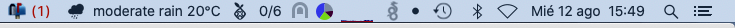
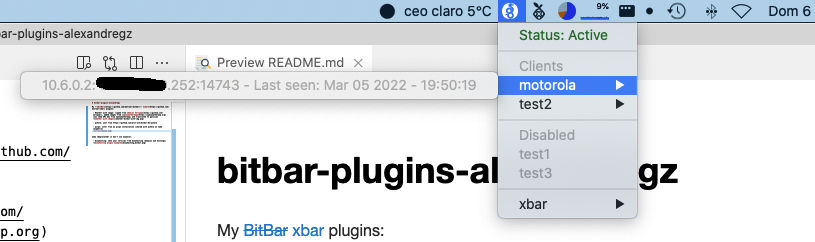
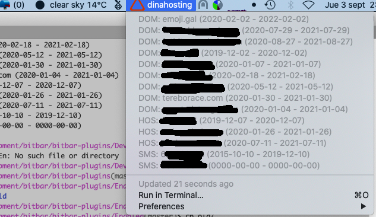

# bitbar-plugins-alexandregz

My ~~[BitBar](https://github.com/matryer/bitbar)~~ [xbar](https://github.com/matryer/xbar) plugins:

 - Weather with image: ripped from [Daniel Seripap](https://github.com/seripap/), added images from [openweathermap](https://openweathermap.org) (you need API key from openweathermap) and translated to galician
 

 - pihole: just from https://github.com/alst-ovh/bitbar-dw-pihole

 - pivpn: infor from my pivpn installation (shared with pihole on same raspberry)
 

Some *deprecated* (I don't use anymore):

 - dinahosting: show your services from dinahosting (domains and hostings)
 

 - check imap: check a IMAP account to show not read messages