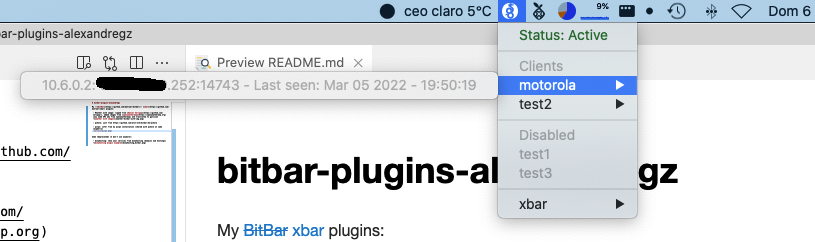

# xbar pivpn

xbar plugin to show pivpn infor (clients and status actually)


## Installation on pivpn

- copy this file to /usr/local/src/pivpn/scripts:

```bash
pi@raspberrypi:/var/www/html/admin (master) $ sudo ln -s /usr/local/src/pivpn 
````

- to use with `lighttpd` installed by [pihole](https://pi-hole.net/), you need to create link into `/var/www/html/admin/`:
 
```bash
pi@raspberrypi:/var/www/html/admin (master) $ sudo ln -s /usr/local/src/pivpn/scripts/api.php api-pivpn.php
pi@raspberrypi:/var/www/html/admin (master) $
```

- also you need to add to sudoers clientSTAT.sh script:

```bash
root@raspberrypi:/etc/sudoers.d# cat /etc/sudoers.d/clientSTAT
www-data ALL=NOPASSWD: /usr/local/src/pivpn/scripts/wireguard/clientSTAT.sh
root@raspberrypi:/etc/sudoers.d#
```

 - restart `lighttpd`

```bash
pi@raspberrypi:/usr/local/src/pivpn/scripts (master) $ sudo systemctl restart lighttpd
pi@raspberrypi:/usr/local/src/pivpn/scripts (master) $
```

## Installation on xbar

- link into xbar plugins directory or directly copy here `pivpn.1m.php` file:
```bash
alex@vosjod:~/Library/Application Support/xbar/plugins$ ln -s /Users/alex/Development/bitbar/bitbar-plugins-alexandregz/pivpn/pivpn.1m.php pivpn.1m.php
alex@vosjod:~/Library/Application Support/xbar/plugins$
```


## Screenshots

Status ok:

 
 

---

Disabled:

 
 